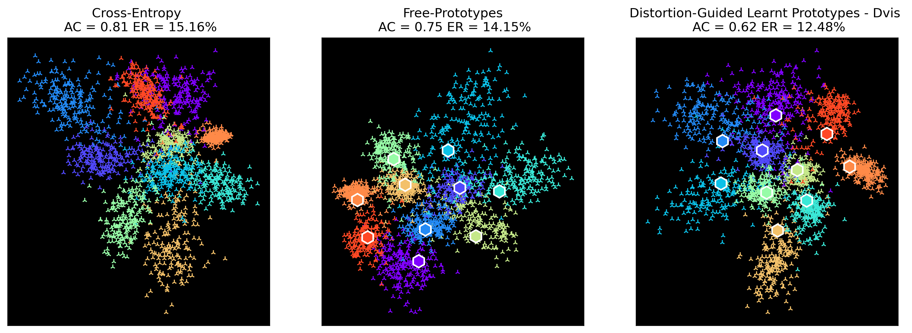

# Metric-Guided Prototype Learning
PyTorch implementation of [Metric-Guided Prototype Learning]() for hierarchical classification.
The modules implemented in this repo can be applied to any classification task where a metric can be defined on the class set, *i.e.* when not all misclassifications have the same cost. Such a metric can easily be derived from the hierarchical structure of most class sets. 

## Installation

### Requirements
The `torch_prototypes` package only requires an environment with PyTorch installed (only tested with version 1.5.0).
For the DeepNCM, and Hierarchical Inference module [torch_scatter](https://github.com/rusty1s/pytorch_scatter) is also required. 
The installation of torch_scatter can be challenging, if you do not need the two latter modules please use the [no_scatter]() branch of this repo.  

|                                 | PyTorch | torch_scatter |
|---------------------------------|:-------:|:-------------:|
| Learnt Prototypes               |    x    |               |
| Hyperspherical Prototypes       |    x    |               |
| DeepNCM                         |    x    |       x       |
| Hierarchical Inference (Yolov2) |    x    |       x       |

### Install 
All the methods presented in the paper are implemented as PyTorch modules packaged in torch_prototypes.
To install the package, run `pip install -e .` inside the main folder. 

## Code 
The package torch_prototypes contains the implementation of the different methods shown in the paper as `torch.nn` modules. 
- "free" learnt prototypes
- metric-guided prototypes (learnt and fixed) 
- hyperspherical prototypes
- hierarchical inference (YOLOv2 hierarchical classification)
- Distortion loss, Rank loss, and hypershperical prototype loss

### Example usage on MNIST
We show how to use the code to reproduce Figure 1 of the paper in the notebook `mgp.ipynb`. 
The notebook can also be directly run on [this google colab]().

### Advanced usage

coming soon

## Reference

Please include a reference to the following paper if you are using any learnt-prototype base method (proper reference coming soon):

- *Metric-Guided Prototype Learning*, Sainte Fare Garnot Vivien and Landrieu Loic

For the hyperspherical prototypes, DeepNCM and Yolov2, respectively:
- *Hyperspherical Prorotype Network*, Mettes Pascal and van der Pol Elise and Snoek, NeurIPS 2019
- *DeepNCM: deep nearest class mean classifiers*, Guerriero Samantha and Caputo Barbara and Mensink Thomas, ICLR Workshop 2018
- *YOLO9000: better, faster, stronger*, Redmon Joseph and Farhadi Ali, CVPR 2017