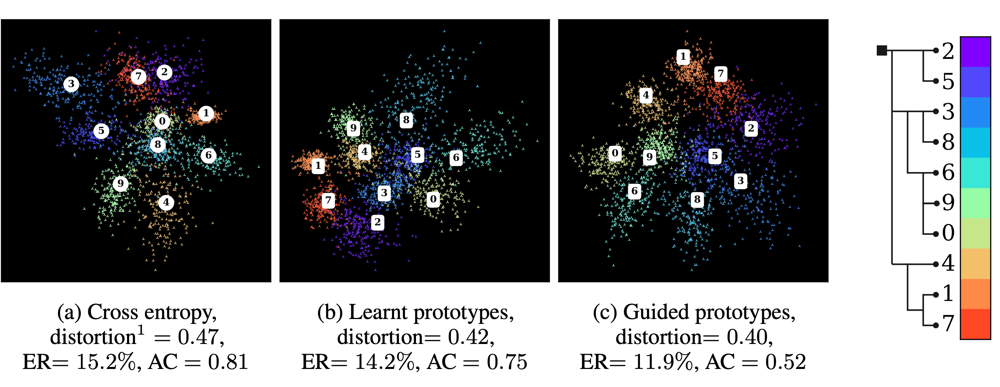

# Metric-Guided Prototype Learning
PyTorch implementation of [Metric-Guided Prototype Learning](https://arxiv.org/abs/2007.03047) for hierarchical classification.
The modules implemented in this repo can be applied to any classification task where a metric can be defined on the class set, *i.e.* when not all misclassifications have the same cost. Such a metric can easily be derived from the hierarchical structure of most class sets. 




### Example usage on MNIST
We show how to use the code to reproduce Figure 1 of the paper in the notebook `mgp.ipynb`. 
The notebook can also be directly run on [this google colab](https://colab.research.google.com/drive/1VoQfBx5q5lWFev0cwxLZ0qQOZU7Rlmb_#offline=true&sandboxMode=true).

## Installation

### Requirements
The `torch_prototypes` package only requires an environment with PyTorch installed (only tested with version 1.5.0).
For the DeepNCM, and Hierarchical Inference module [torch_scatter](https://github.com/rusty1s/pytorch_scatter) is also required. 
The installation of torch_scatter can be challenging, if you do not need the two latter modules please use the [no_scatter](https://github.com/VSainteuf/metric-guided-prototypes-pytorch/tree/no_scatter) branch of this repo.  

|                                 | PyTorch | torch_scatter |
|---------------------------------|:-------:|:-------------:|
| Learnt Prototypes               |    x    |               |
| Hyperspherical Prototypes       |    x    |               |
| DeepNCM                         |    x    |       x       |
| Hierarchical Inference (Yolov2) |    x    |       x       |

### Install 
All the methods presented in the paper are implemented as PyTorch modules packaged in torch_prototypes.
To install the package, run `pip install -e .` inside the main folder. 


## Code 
The package torch_prototypes contains different methods shown in the paper, implemented as `torch.nn` modules: 
- Learnt prototypes
- Metric-guided prototypes (learnt and fixed) 
- Distortion and *scale free* distortion
- Distortion loss, Rank loss
- Hyperspherical prototypes and associated loss
- Hierarchical inference (YOLOv2 hierarchical classification)
- Soft labels


### Generic usage

#### Model definition
The modules in the `torch_prototypes` package are applicable to any classification problem.
They all follow the same paradigm of being wrapper modules around a backbone neural architecture that maps the samples `X` of a dataset to embeddings `E`.

For example, the following lines define a learnt-prototypes classification model with ResNet18 backbone for image embedding.
Backward gradient computations will propagate both to the prototypes and to the backbone's weights.
```python
from torch_prototypes.modules import prototypical_network
from torchvision.models.resnet import resnet18

backbone = resnet18()
emb_dim = backbone.fc.out_features
num_classes = 100

model = prototypical_network.LearntPrototypes(backbone, n_prototypes=num_classes, embedding_dim=emb_dim)

```

#### Model output
The output of the wrapper model can be treated as regular classification logits:
```python
import torch.nn as nn
xe = nn.CrossEntropyLoss()

logits = model(X)
loss = xe(logits, Y)
prediction = logits.argmax(dim=-1)
```

#### Metric-guided regularization
The `torch_prototypes` package also contains the loss functions (DistortionLoss and RankLoss) to implement metric-guided regularization.
The metric needs to be given in the form of a tensor `D` of shape `num_classes x num_classes` that defines the pairwise misclassification costs.
Once defined, these losses can be applied to the model's prototypes to guide the learning process:

```python
import torch
import torch.nn as nn
from torch_prototypes.metrics.distortion import DistortionLoss

xe = nn.CrossEntropyLoss()

D = torch.rand((num_classes,num_classes)) #Dummy cost tensor
disto_loss = DistortionLoss(D=D)

logits = model(X)
loss = xe(logits, Y) + disto_loss(model.prototypes)


```

By default `DistortionLoss` computes our *scale-free* definition of the distortion (see paper).


## References

Please include a reference to the following paper if you are using any of the learnt-prototype based methods:

```
@article{garnot2020mgp,
  title={Metric-Guided Prototype Learning},
  author={Sainte Fare Garnot, Vivien  and Landrieu, Loic},
  journal={arXiv preprint arXiv:2007.03047},
  year={2020}
}

```
For the hyperspherical prototypes, DeepNCM and Yolov2, respectively:
- *Hyperspherical Prorotype Network*, Mettes Pascal and van der Pol Elise and Snoek, NeurIPS 2019
- *DeepNCM: deep nearest class mean classifiers*, Guerriero Samantha and Caputo Barbara and Mensink Thomas, ICLR Workshop 2018
- *YOLO9000: better, faster, stronger*, Redmon Joseph and Farhadi Ali, CVPR 2017